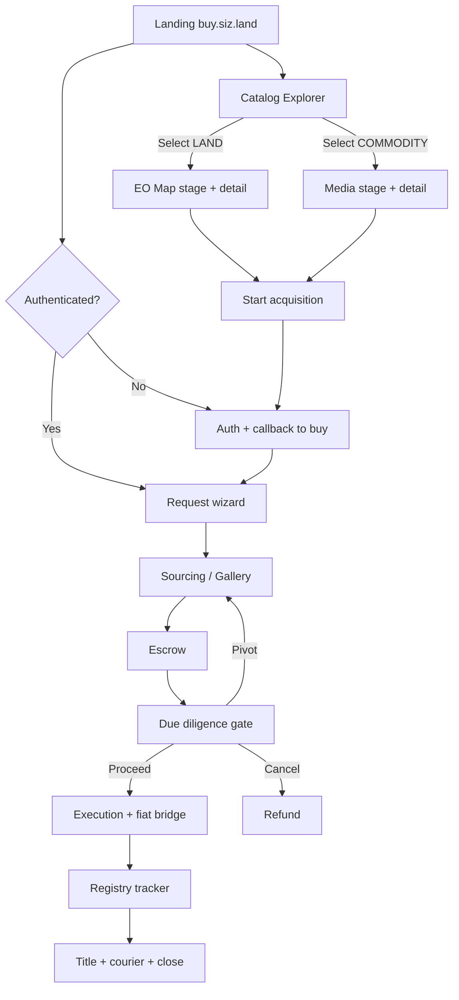

# buy.siz.land — Full Product Workflow

**Status:** Spec for implementation (supersedes informal “browse → empty lands” UX)  
**Related:** [CHANGE-PLAN.md](./CHANGE-PLAN.md) (June sprint deltas) · [DESIGN-SYSTEM.md](./DESIGN-SYSTEM.md) (UI layout & tokens)  
**External:** [Copernicus Data Space Ecosystem APIs](https://dataspace.copernicus.eu/analyse/apis)

This document defines the **end-to-end client journey** on `buy.siz.land`: landing → catalog → selection → auth → request → sourcing → escrow → diligence → settlement — including a **multi-commodity** model where **land uses a live EO map** and **non-spatial commodities use media in the same layout slot**.

---

## 0. Product thesis (one sentence)

buy.siz.land is Sizland’s **acquisition portal**: investors discover curated African (and later global) assets, start a protected purchase, and track trust milestones — with **EU Earth Observation** as the spatial truth layer for land, not a generic street map.

---

## 1. Copernicus vs OpenStreetMap — recommendation

### 1.1 What people confuse

| Layer | Role | What we have today |
|-------|------|--------------------|
| **Map engine** | Pan, zoom, markers, click-to-select, bounds | MapLibre (`OsmMapLibre.tsx`) |
| **Basemap tiles** | Visual ground under markers | OpenStreetMap raster tiles |
| **Earth Observation** | True satellite surface imagery, cloud filters, revisit history, “Satellite-Verified” | Partial (badge + optional static `imageryUrl`); not live tiles |

[Copernicus Data Space Ecosystem APIs](https://dataspace.copernicus.eu/analyse/apis) (**STAC / OData catalogue, Sentinel Hub, OGC WMS/WMTS, openEO**) provide **imagery and processing**, not a drop-in replacement for Leaflet/MapLibre as a mapping library.

**Verdict:** Do **not** “throw away Leaflet/MapLibre for Copernicus.” Keep MapLibre for interaction; **replace or overlay OSM with Copernicus / Sentinel Hub tiles** so the map shows planetary surface (Sentinel-2 true color / NDVI etc.), not cartographic streets.

### 1.2 Recommended architecture (hybrid)

```
┌─────────────────────────────────────────────────────────────┐
│  Client (MapLibre)                                          │
│   • Markers for all published LAND listings                 │
│   • Optional light reference layer (labels / coastlines)    │
│   • Primary visual: Sentinel Hub / OGC WMTS EO tiles        │
└───────────────────────────┬─────────────────────────────────┘
                            │ tile + Process API (server-proxied)
┌───────────────────────────▼─────────────────────────────────┐
│  Sizland BFF (Next `/api/satellite/*` + SIZBackend2.0)      │
│   • CDSE OAuth / Sentinel Hub credentials (server-only)     │
│   • Catalogue search (STAC/OData) by plot AOI + date        │
│   • Cache tile URLs / Process API PNGs in Redis             │
│   • Persist SatelliteVerification per LandPlot / LandListing│
└───────────────────────────┬─────────────────────────────────┘
                            │
┌───────────────────────────▼─────────────────────────────────┐
│  Copernicus Data Space Ecosystem                            │
│   Catalogue · Sentinel Hub · OGC · openEO (later analytics) │
└─────────────────────────────────────────────────────────────┘
```

### 1.3 Why hybrid (not “Sentinel-only, no OSM”)

1. **EO alone** at world zoom is hard to navigate (no place names, cloud gaps). Keep a **faint label/reference layer** or allow toggle: `Satellite` | `Reference`.
2. **Sentinel-2 is near-live, not live video** — revisit ~5 days; cloudy scenes must be filtered via catalogue.
3. **Secrets** (CDSE client id/secret) must stay on the backend; never in the browser.
4. **Admin upload** still needs click-to-pin (MapLibre + picker); after pin, backend fetches latest clear Sentinel-2 for that AOI and stores evidence.
5. Aligns with existing CASSINI / Trust-as-a-Service narrative already on buy-land.

### 1.4 API usage map (what we use when)

| CDSE capability | Use on buy.siz.land |
|-----------------|---------------------|
| **Sentinel Hub** Process / Catalog | Interactive map tiles + on-demand true-color for selected plot |
| **OGC WMS/WMTS** | Alternative tile source into MapLibre raster source |
| **STAC / OData** | Admin “find clearest scene” for AOI; store scene id + date |
| **openEO** | Later: NDVI / change detection / drought for diligence reports |
| **On-Demand Processing** | Rare; only if L2 product missing online |

### 1.5 Acceptance criteria (map)

- [ ] Catalog map shows **all published land** pins with price/status labels.
- [ ] Default basemap is **EO surface imagery** (Sentinel), not OSM streets.
- [ ] Toggle or dual-layer: EO primary + optional reference labels.
- [ ] Selecting a pin flies to AOI; detail panel shows **Satellite-Verified** with scene date.
- [ ] Admin geo-pick → automatic verification job → badge when evidence stored.
- [ ] Attribution: Copernicus / ESA / Sentinel Hub (plus any residual OSM labels if used).

---

## 2. Asset model — land vs other commodities

buy.siz.land is **not land-only forever**. The catalog is a **unified marketplace of Sizland offerings**.

### 2.1 Listing kinds

| Kind | `spatial` | Right-pane / stage content | Example |
|------|-----------|------------------------------|---------|
| **LAND** | Required (`lat/lng` + optional boundary) | Interactive EO map + pins | Kenyan acreage, leasehold parcels |
| **COMMODITY** | Not required | **Media stage** (hero gallery / video) fills the same viewport the map would occupy | Agri lots, packaged produce, carbon/ESG units, education bundles (MOOC — pending brief), tokenized inventory SKUs |

### 2.2 Shared listing fields (catalog)

- `id`, `slug`, `title`, `kind` (`LAND` | `COMMODITY`)
- `status` (Draft / Published / Reserved / Sold / Archived)
- `region` (Africa, Europe, … — filter chips)
- `price`, `currency`
- `badges` (Recommended, Title Ready, Tier A, Satellite-Verified, Survey verified, …)
- `tags` (Access road, No encumbrances, …)
- `media[]` (images/video — **required for COMMODITY**; optional for LAND)
- `score` (optional trust / match score)
- LAND-only: `latitude`, `longitude`, `boundaryGeoJSON`, `areaAcres`, `terrain`, `satelliteVerification`
- COMMODITY-only: `sku`, `unit`, `quantityAvailable`, `specs{}`

### 2.3 Stage switching rule (critical UX)

The **primary visual stage** (right / center large pane) is driven by **active filter + selection**:

```
IF catalog filter kind includes LAND (or “All” with ≥1 land in result set)
  AND user has not forced “Media view”
→ Stage = MAP (all land pins for current result set)

IF catalog filter is COMMODITY-only
  OR selected item.kind === COMMODITY
→ Stage = MEDIA (selected commodity gallery; if none selected, featured media carousel)

IF selected item.kind === LAND
→ Stage = MAP focused on that pin + optional EO detail overlay
```

**Important:** On “All”, the map still shows **only spatial listings**. Non-land items appear in the **left list** only; selecting one **swaps the stage to media** without removing the list. Returning to a land card restores the map.

---

## 3. Information architecture & routes

Host: `buy.siz.land` (middleware already rewrites `/` → buy flow).

| Route | Purpose |
|-------|---------|
| `/` · `/buy-land` | Marketing landing + entry CTAs |
| `/catalog` (new; evolves `/browse-land` + `/lands`) | **Explorer**: filters + list + map/media stage |
| `/catalog/[id]` | Deep link; same explorer with selection open (shareable) |
| Auth chain | `/auth-choice`, `/login`, `/signup`, `/wallet-auth`, `/sso-callback` — **return to buy callback** |
| `/request` or wizard on `/buy-land?step=` | Acquisition request wizard (post-auth) |
| `/request/status` | Progress / sourcing / diligence / registry tracker |
| `/admin/land` (+ future `/admin/catalog`) | Ops: upload listings, pins, media, DD docs |

Deprecate dual UX of “browse-land vs lands empty state” into **one Explorer** with states: browsing | sourcing | diligence.

---

## 4. End-to-end client journey

### Phase A — Land on the page

1. User opens `buy.siz.land`.
2. Sees branded hero (Europe → Africa / remote ownership), trust pillars (DD, Escrow, Satellite-Verified), How it Works.
3. CTAs:
   - **Explore catalog** → `/catalog` (public)
   - **Start a request** → if unauthenticated → auth with `callbackUrl` back to buy; if authenticated → wizard
4. Header: Sign In / theme toggle aligned; logo stays on buy host.

### Phase B — Catalog Explorer (inspired by reference UI)

**Layout:** top filter chips · left results list · large stage (map **or** media) · optional detail drawer on select (see DESIGN-SYSTEM.md).

1. Default filter: **All** or **Land** (product choice; recommend Land-first for MVP).
2. User filters by region, status, terrain, satellite-verified, entry-price, etc.
3. Sort: Best match · Price · Area (land) · Newest.
4. **Map mode (land):** all matching land pins visible; click pin ↔ selects list card.
5. **Select land:** detail panel opens (metrics, badges, price, tags, score, EO scene meta, CTA).
6. **Select commodity:** stage switches to media gallery; detail panel shows specs / units / CTA.
7. Primary CTA on item: **Start acquisition** / **Reserve** / **Buy** → auth gate → request flow with listing pre-attached.

Empty published land while a request exists → **Sourcing in Progress** (48h expert message) — see CHANGE-PLAN.md.

### Phase C — Authentication (buy-scoped)

1. Any gated CTA stores `callbackUrl` (listing id, step).
2. After login/signup/wallet, **never dump to ERP `/lobby`** when origin is buy.
3. Resume exactly: open explorer with selection, or open wizard step.

### Phase D — Intake request (wizard)

Aligned with June form + Internalized Logic Story 1:

1. Login (done)
2. Connect wallet (Algorand / supported)
3. Create request: **Name**, **Email**, Budget, Size, Purpose, optional plot ref, Terms  
   - If started from a listing, `listingId` / purpose prefilled
4. Submit → success: **Request Received & Expert Sourcing Initiated** (or gallery if plots already attached)

Backend flags email for ops follow-up (&lt;48h).

### Phase E — Discovery gallery (ops-sourced)

1. Admin sources options → uploads Digital Gallery (geo-pins, photos, video) onto the request.
2. Client reviews in Explorer-like “Your options” or request status view.
3. Client selects preferred plot.

### Phase F — Escrow & Due Diligence Safety Gate

1. Fund escrow (full budget or initial DD tranche — product amounts per ops; UI must show which).
2. Notary unlock for registry search / site visit.
3. DD Report upload → Title Verified / Site Verified checks.
4. Client: **Proceed** | **Pivot** (complimentary visits policy) | **Cancel** (refund remainder).

### Phase G — Execution & fiat bridge

1. Client **Initiate Purchase** → authorize crypto→KES disclaimer.
2. Funds to Notary wallet; seller paid offline.
3. Gate: UI does not advance to Transfer Initiated until payment receipt uploaded.
4. Client UI: documents secured in legal vault message.

### Phase H — Registry tracker & completion

1. Lodgement receipt + progress (e.g. Day X of 21) + ETA.
2. Final title scan; facilitation fee; courier tracking for physical deed.
3. Complete only when valid tracking number entered (logic gate).

### Phase I — Post-close

- Receipts, title digital copy, optional MOOC / education modules (**pending brief**).
- Upsell related commodities without leaving buy host.

---

## 5. Admin / Notary workflow (must exist for client UX to work)

| Role | Actions |
|------|---------|
| **Catalog admin** | Create LAND (pin on EO map, media) or COMMODITY (media-first); publish; badges; price |
| **Sourcing** | Attach plots to a buyer request; notify email |
| **Notary** | DD docs, fiat payment log (KES vs crypto), ETA dates, lodgement, title, tracking |
| **System** | CDSE fetch on pin save; cache verification; status webhooks to client UI |

Additive-only on shared `SIZBackend2.0` (see CASSINI plan).

---

## 6. State machine (request)

```
DRAFT
  → SUBMITTED          (intake complete; sourcing UI)
  → OPTIONS_READY      (plots attached; gallery)
  → PLOT_SELECTED
  → ESCROW_FUNDED      (or PILOT_SIMULATED)
  → DUE_DILIGENCE      (report uploaded)
  → CLIENT_PROCEED | CLIENT_PIVOT | CLIENT_CANCEL
  → EXECUTION          (fiat bridge; receipt lock)
  → REGISTRY_TRANSFER  (lodgement + ETA)
  → COMPLETED          (title + tracking)
  → REFUNDED | ARCHIVED
```

Map these to existing statuses where possible; extend only with nullable fields / additive enums.

---

## 7. Technical workstreams checklist

### 7.1 Frontend

- [ ] Unify Explorer page (list + stage + detail)
- [ ] Stage switcher: Map vs Media by listing kind
- [ ] MapLibre EO style (Sentinel Hub / WMTS) + markers for all lands
- [ ] Auth callback fix (buy host)
- [ ] Wizard Name/Email + sourcing empty state
- [ ] Request status / registry tracker screens
- [ ] Deep links `/catalog/[id]`

### 7.2 Backend

- [ ] Public catalog API: filter by kind, region, badges; geo for lands
- [ ] Listing CRUD admin (land + commodity)
- [ ] CDSE credentials + satellite proxy (extend `/api/satellite`)
- [ ] Verification job on lat/lng save
- [ ] Request + email outreach flag
- [ ] Document + receipt + tracking gates

### 7.3 Ops / content

- [ ] Seed Kenya pilot listings with real coords
- [ ] Define badge taxonomy
- [ ] Notary playbook for DD uploads
- [ ] Commodity pilot SKU (when chosen)

### 7.4 Pending inputs (do not invent)

- [ ] MOOC modules brief
- [ ] Property mapping widget extras (if beyond admin pin + EO)
- [ ] Final commodity catalog beyond land

---

## 8. Journey diagram (summary)



---

## 9. Non-goals (this workflow doc)

- Cloning TokenizLand tokenization UI 1:1 (fractional token sales) — optional later; Sizland lead is **Trust-as-a-Service + acquisition**, not simulated crowdfunding unless product explicitly adds it.
- Replacing MapLibre with a Copernicus “map website”.
- Building MOOC/mapping widgets before briefs arrive.

---

## 10. Definition of done (full workflow MVP)

1. Public Explorer with land pins on **Copernicus/Sentinel imagery** via MapLibre.  
2. Commodity path uses **media stage** in the same slot.  
3. Auth always returns to buy context.  
4. Request → sourcing → select → escrow → DD status visible to client.  
5. Admin can publish land with pin → auto satellite evidence.  
6. Design matches [DESIGN-SYSTEM.md](./DESIGN-SYSTEM.md).

When in doubt: **spatial truth for land, media truth for commodities, escrow + notary for money and title.**
